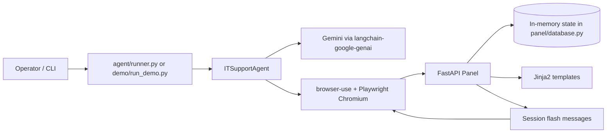

# IT Support AI Agent

AI-driven IT operations assistant that executes natural-language support requests through a browser against a mock admin panel.

The project intentionally uses full browser interaction (via `browser-use` + Playwright) rather than direct API shortcuts, so behavior is close to how a human IT admin would operate a real dashboard.

## Table of Contents
- [1. Project Overview](#1-project-overview)
- [2. What We Built](#2-what-we-built)
- [3. System Architecture](#3-system-architecture)
- [4. Component Deep Dive](#4-component-deep-dive)
- [5. API Routes and UI Pages](#5-api-routes-and-ui-pages)
- [6. Agent Execution Model](#6-agent-execution-model)
- [7. Configuration](#7-configuration)
- [8. Local Setup and Runbook](#8-local-setup-and-runbook)
- [9. Testing and Demo](#9-testing-and-demo)
- [10. Repository Structure](#10-repository-structure)
- [11. Troubleshooting](#11-troubleshooting)
- [12. Security and Git Hygiene](#12-security-and-git-hygiene)
- [13. Current Status and Next Steps](#13-current-status-and-next-steps)

## 1. Project Overview

This repository contains two tightly-coupled runtime parts:

1. **IT Admin Panel** (`panel/`)
	 - FastAPI server with Jinja2 templates.
	 - In-memory data store for users, licenses, and audit trail.
	 - Session-based flash messages used by the browser agent as feedback signals.

2. **Browser Agent** (`agent/`)
	 - Gemini-powered reasoning through `langchain-google-genai`.
	 - Browser control through `browser-use` and Playwright Chromium.
	 - Executes operational tasks such as reset password, create user, assign/revoke licenses, and multi-step onboarding flows.

## 2. What We Built

### Completed capabilities
- User lifecycle operations: create, activate, suspend.
- Password reset flow with generated temporary password (`Temp####!`).
- License assignment and revocation.
- Audit logging for admin actions.
- Prompt-constrained browser agent with deterministic settings (`temperature=0.0`).
- CLI task runner and multi-scenario demo runner.
- Hardened alternate agent implementation (`agent/t_agent.py`) with retry/backoff and anti-loop safeguards.

### Why this architecture
- Keeps panel logic transparent and testable via straightforward server routes.
- Keeps agent behavior realistic by forcing browser-first workflows.
- Supports iterative prompt/agent hardening without redesigning server internals.

## 3. System Architecture



### Key runtime flow
1. Operator submits natural-language request.
2. Agent enriches it with strict system context and navigation constraints.
3. Agent performs browser actions against panel pages.
4. Panel updates in-memory state and sets flash feedback.
5. Agent returns a completion summary plus status (`SUCCESS`, `PARTIAL`, `FAILED`).

## 4. Component Deep Dive

### 4.1 Panel service (`panel/`)

**Main app bootstrap** (`panel/main.py`)
- Configures FastAPI app.
- Adds session middleware (`SessionMiddleware`).
- Mounts static assets (`/static`).
- Registers routers:
	- `panel.routes.users`
	- `panel.routes.passwords`
	- `panel.routes.licenses`
- Implements dashboard route (`/`) with aggregate user statistics and latest audit entries.

**State layer** (`panel/database.py`)
- Keeps all data in process memory (`_state`).
- Stores:
	- user records
	- available licenses
	- audit log events
- Exposes:
	- `get_state()` for read/write access
	- `log_action()` for standardized audit entries

### 4.2 Agent service (`agent/`)

**Primary agent** (`agent/agent.py`)
- `ITSupportAgent` with:
	- Gemini model initialization
	- browser lifecycle management
	- system-context-driven task formatting
	- task execution via `agent.run(max_steps=...)`
- Returns normalized result object:
	- `task`
	- `result`
	- `success`

**Hardened variant** (`agent/t_agent.py`)
- Includes production hardening patterns:
	- retry with exponential backoff (`tenacity`)
	- 429-aware handling (`ResourceExhausted`)
	- step throttling to stay within RPM limits
	- stricter minimal prompt for anti-loop behavior
	- guaranteed browser close in `finally`

**CLI runner** (`agent/runner.py`)
- Command-line entry point for one-off tasks.
- Usage: `python -m agent.runner "<task>"`.

**Task template helper** (`agent/tasks.py`)
- Reusable task templates for common workflows:
	- reset password
	- create user
	- suspend/activate
	- assign license
	- check-and-create
	- full onboarding

## 5. API Routes and UI Pages

### Users routes (`panel/routes/users.py`)
- `GET /users`: list users.
- `POST /users/create`: create user with validation on duplicate email.
- `GET /users/{email}`: user detail page.
- `POST /users/{email}/suspend`: suspend account.
- `POST /users/{email}/activate`: activate account.

### Password routes (`panel/routes/passwords.py`)
- `GET /reset-password`: render reset page.
- `POST /reset-password`: reset user password and show temporary password in flash message.

### License routes (`panel/routes/licenses.py`)
- `GET /licenses`: license management page.
- `POST /licenses/assign`: assign license with duplicate check.
- `POST /licenses/revoke`: revoke assigned license.

### Templates (`panel/templates/`)
- `base.html`: shared layout and nav.
- `index.html`: dashboard summary.
- `users.html`: user list and create form.
- `user_detail.html`: per-user operations.
- `reset_password.html`: reset form and result flash.
- `licenses.html`: assignment and revocation workflows.

## 6. Agent Execution Model

### Determinism and control
- `temperature=0.0` used to reduce randomness and operational drift.
- Fixed system instructions enforce:
	- browser-only interactions
	- page navigation discipline
	- explicit task summary output

### Safety and reliability patterns
- Browser lifecycle cleanup in `finally` blocks.
- Max-step boundaries via `AGENT_MAX_STEPS`.
- Optional headless mode for CI/non-UI runs.
- In hardened agent: retry/backoff + step-delay throttling.

### Output contract
Agent output is expected to include:
- original task
- status (`SUCCESS` | `PARTIAL` | `FAILED`)
- executed actions
- resulting state, including temporary password when applicable

## 7. Configuration

Environment values are defined in `.env.example`.

| Variable | Purpose | Default |
|---|---|---|
| `GEMINI_API_KEY` | Required API key for Gemini provider | `"your-key-here"` |
| `PANEL_BASE_URL` | Base URL for panel navigation | `http://127.0.0.1:8000` |
| `AGENT_HEADLESS` | Headless browser mode toggle | `false` |
| `AGENT_MAX_STEPS` | Max browser-use steps per task | `25` |
| `AGENT_STEP_DELAY` | Step delay (used in hardened agent) | `4.0` |
| `PLAYWRIGHT_BROWSERS_PATH` | Shared Playwright browser cache path | `D:\decawork\playwright-browsers` |
| `GEMINI_MODEL` | Preferred Gemini model name | `gemini-2.0-flash` |

## 8. Local Setup and Runbook

> Run all commands from repository root (`it-support-agent/`) unless noted.

### 8.1 Install dependencies

```bash
pip install -r requirements.txt
playwright install chromium
```

### 8.2 Create environment file

```bash
cp .env.example .env
# Edit .env and set GEMINI_API_KEY
```

### 8.3 Activate virtual environment

**Windows (PowerShell):**

```bash
.\deca\Scripts\activate
```

**macOS/Linux:**

```bash
source deca/bin/activate
```

### 8.4 Start panel server

```bash
python -m uvicorn panel.main:app --host 127.0.0.1 --port 8000 --reload
```

Open: `http://127.0.0.1:8000`

### 8.5 Run one agent task

```bash
python -m agent.runner "Reset password for alice@company.com"
```

### 8.6 Run demo sequence

```bash
python demo/run_demo.py
```

## 9. Testing and Demo

### Lightweight smoke test

`t_agent.py` performs a minimal browser + LLM execution path to validate toolchain wiring.

```bash
python test_agent.py
```

### Demo script coverage
`demo/run_demo.py` executes three representative scenarios:
1. reset existing user password
2. create and license a new user
3. conditional check-create-reset-license workflow

## 10. Repository Structure

```text
it-support-agent/
	.env.example                 # Environment template
	.gitignore                   # Ignore rules for local/dev artifacts
	README.md                    # Project documentation
	requirements.txt             # Python dependencies
	test_agent.py                # Smoke test for agent pipeline

	agent/
		__init__.py                # Package marker
		agent.py                   # Primary ITSupportAgent implementation
		t_agent.py                 # Hardened agent variant (retry/throttle)
		runner.py                  # CLI entry point for single task execution
		tasks.py                   # Natural-language task templates

	panel/
		main.py                    # FastAPI app bootstrap and dashboard
		database.py                # In-memory state and audit logging helpers

		routes/
			__init__.py              # Route package marker
			users.py                 # User CRUD-like operational routes
			passwords.py             # Password reset routes
			licenses.py              # License assignment/revocation routes

		templates/
			base.html                # Shared base layout and nav
			index.html               # Dashboard
			users.html               # User list/create
			user_detail.html         # Per-user detail + actions
			reset_password.html      # Password reset page
			licenses.html            # License management page

		static/
			style.css                # Styling for panel UI and flash messages

	demo/
		run_demo.py                # Multi-task demo runner

	deca/                        # Local virtual environment (ignored in git)
```

## 11. Troubleshooting

### 11.1 `ModuleNotFoundError: No module named 'panel'`
Cause: server started from `agent/` subfolder.

Fix:
1. `cd` to repository root.
2. Run `python -m uvicorn panel.main:app --host 127.0.0.1 --port 8000 --reload`.

### 11.2 Script appears to stop after telemetry logs
If running `agent/t_agent.py`, ensure file includes an executable `__main__` block (present in current repo).

Use:

```bash
python agent/t_agent.py
```

or preferred runner:

```bash
python -m agent.runner "Reset password for alice@company.com"
```

### 11.3 Browser not launching
- Ensure Chromium is installed via `playwright install chromium`.
- Ensure `PLAYWRIGHT_BROWSERS_PATH` points to a valid location if customized.

### 11.4 Rate limits from Gemini
- Reduce step volume (`AGENT_MAX_STEPS`).
- Increase delay (`AGENT_STEP_DELAY`) in hardened agent.
- Retry after cooldown period.

## 12. Security and Git Hygiene

- Never commit real API keys.
- Keep `.env` untracked and use `.env.example` placeholders only.
- If push protection blocks your push due to leaked secret in history:
	1. sanitize file content
	2. rewrite local git history to remove leaked commit(s)
	3. force-push cleaned branch with `--force-with-lease`

## 13. Current Status and Next Steps

### Current status
- End-to-end panel + browser automation flow is implemented.
- CLI and demo execution paths are available.
- Hardened variant exists for stability under model rate limits.

### Recommended next improvements
1. Replace in-memory state with persistent storage (SQLite/PostgreSQL).
2. Add formal test suite (unit + integration + browser automation assertions).
3. Add structured logging and trace IDs for task observability.
4. Introduce role-based auth for panel operations.
5. Add CI pipeline checks for linting, tests, and secret scanning.